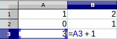
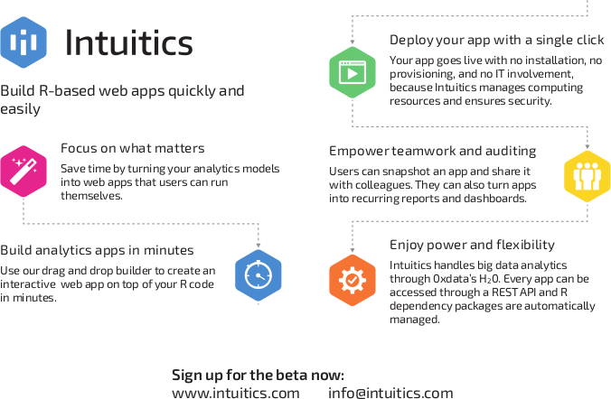

## Contents

* What is Shiny?
* Installing and Using Shiny
* Your First Shiny App


# What is Shiny?


## US Demographics by County

```{r, echo=FALSE, eval=TRUE}
source("./examples/census.r")
shinyApp(ui=ui, server=server)
```


## US Demographics by County: UI Code

```{r, echo=TRUE, eval=FALSE}
fluidPage(
  titlePanel("2010 US Census"),
  
  sidebarLayout(
    sidebarPanel(
      selectInput("var", 
        label="Choose a variable to display",
        choices=c("% White", "% Black", "% Hispanic", "% Asian"),
        selected="% White"),
      
      sliderInput("range", label="Range of interest:",
        min=0, max=100, value=c(0, 100))
    ),
    
    mainPanel(plotOutput("map"))
  )
)
```


## Performance of the Top 500 Supercomputers

```{r, echo=FALSE, eval=TRUE}
source("./examples/RTop500.r")
shinyApp(ui=ui, server=server)
```


## What is Shiny?

* An R package.
* A quasi-domain specific language.
* Interactive.
* A way to put R and analytics in the browser.
* A bridge between R and HTML/javascript.


## Reactive Programming {.smaller .columns-2}

Shiny uses **reactive programming**:

```
a = 1
b = a + 1
a = 0
```

What is the value of b?

> * In imperative programming, `b == 2`.
> * In reactive programming, `b == 1`.


## Reactive Programming 




## Where Shiny Excels

* Interactive analyses and visualization.
* Interfacing the browser with R.
* Prototyping.


## What Can I Do with Shiny?

#### Products
* Interactive web apps.
* Interactive documents.
* Interactive presentations.

#### Caveats
* Backend must be in R.
* R is a C program, so wrapping is always possible...


## Shiny in HPC

* HPC is becoming **more** interactive, not **less**.
* Many "non-traditional HPC" fields use R.
* Not everyone is a programmer.
* Interactive visualization can be useful even to hardcore programmers.


## "Gateways" and "Portals"

* Obvious usecase for shiny.
* Terminology is confusing...
* Just call it a web app.


# Installing and Using Shiny

## Installing

From R:

```{r, echo=TRUE, eval=FALSE}
install.packages("shiny")
```

That's it!


## Designing a Shiny App

A Shiny app consists of 2 pieces

1. A **ui**
    * The web page part.
    * Stuff the user *directly* interacts with (checkboxes, text fields, buttons, ...).

2. A **server**
    * The backend part.
    * Stuff the user *indirectly* interacts with.

* Each of is just an R script.
* Each is basically what it sounds like.


## Deploying a Shiny App Locally

Option 1: Create `/path/to/app/server.r` and `/path/to/app/ui.r` and run from R:

```{r, echo=TRUE, eval=FALSE}
setwd("/path/to/app")
runApp()
```

Option 2: Create a script containing a ui and server (demo later) and run:

```{r, echo=TRUE, eval=FALSE}
ui <- ...
server <- ...

shinyApp(ui=ui, server=server)
```


## Deploying a Shiny App Remotely

* RStudio hosting at: http://shinyapps.io
* RStudio's shiny server.
* Custom work.


# Your First Shiny App

## Building an Interactive Cluster Identification App


```{r, echo=FALSE, eval=TRUE}
source("./examples/kmeans.r")
shinyApp(ui=ui, server=server)
```


## The Idea

Step 1: Start with an R analysis

```{r, echo=TRUE, eval=FALSE}
clusters <- kmeans(mydata, nclusters)

plot(mydata, col=clusters$cluster, pch=20, cex=3)
points(clusters$centers, pch=4, cex=4, lwd=4)
```


## The UI

Step 2: Design your UI

```{r, echo=TRUE, eval=FALSE}
ui <- fluidPage(responsive = FALSE,
  fluidRow(
    column(width=4, selectInput('xcol', 'X Variable', names(dataset))),
    column(width=4, selectInput('ycol', 'Y Variable', names(dataset),
                          selected=names(dataset)[[2]])),
    column(width=4, numericInput('clusters', 'Cluster count', 3, min=1, max=9))
  ),
  fluidRow(
    plotOutput('kmeans', height = "400px")
  )
)
```


## The Server

Step 3: Translate backend script into reactive Shiny app:

```{r, echo=TRUE, eval=FALSE}
server <- function(input, output, session) {
  selectedData <- reactive({
    dataset[, c(input$xcol, input$ycol)]
  })
  
  clusters <- reactive({
    kmeans(selectedData(), input$clusters)
  })
  
  output$kmeans <- renderPlot({
    plot(selectedData(), col=clusters()$cluster, pch=20, cex=3)
    points(clusters()$centers, pch=4, cex=4, lwd=4)
  })
}
```


## Run the App

Step 4: Put it all together

```{r, echo=TRUE, eval=FALSE}
library(shiny)
dataset <- iris

ui <- ...
server <- ...

shinyApp(ui=ui, server=server)
```


## Play with your App!

```{r, echo=FALSE, eval=TRUE}
source("./examples/kmeans.r")
shinyApp(ui=ui, server=server)
```


# Wrapup

## Summary

* Shiny allows rapid prototyping of interactive webapps.
* Shiny easily connects R to the web (javascript and HTML).
* Nobody cares about your computer but you; call it a freaking webapp.


## Shiny Competitors




## Shiny Resources

#### Where to start

* Official tutorial: http://shiny.rstudio.com/tutorial/
* Shiny manual: http://cran.r-project.org/web/packages/shiny/shiny.pdf

#### Where to get inspired

* Official Examples: http://shiny.rstudio.com/gallery/
* User contributed examples: http://www.showmeshiny.com/

#### Where to get help

* `[shiny]` stackoverflow tag
* `#rshiny` twitter hashtag (also `#rstats`)


## R Resources

#### Books
* The Art of R Programming: http://nostarch.com/artofr.htm
* An Introduction to R:
http://cran.r-project.org/doc/manuals/R-intro.pdf
* The R Inferno:
http://www.burns-stat.com/pages/Tutor/R_inferno.pdf

#### Comparisons to Other Languages
* aRrgh: a newcomer’s (angry) guide to R: http://tim-smith.us/arrgh/
* Mathesaurus: http://mathesaurus.sourceforge.net/
* R programming for those coming from other languages: http://www.johndcook.com/R_language_for_programmers.html


## Thanks for Coming!

This presentation is available at [https://github.com/wrathematics/scshiny](github.com/wrathematics/sc14)

Be sure to come to the R BoF tonight!

* 5:30-7:00pm
* Room 388-89-90
